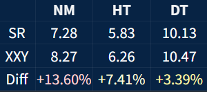
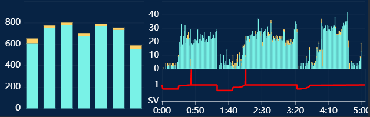
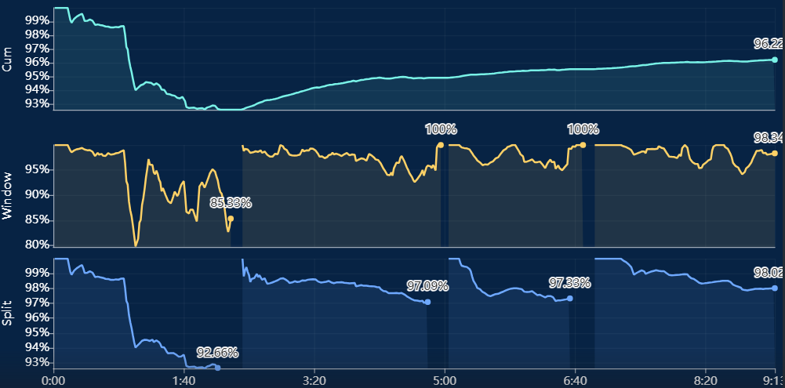

# osu!mania用的tosu overlay

非pp counter，作者不直播，只考虑选图界面和结算界面(还没做)

## 使用

1. 安装[https://github.com/tosuapp/tosu](https://github.com/tosuapp/tosu)
2. 解压到tosu下的static文件夹
3. 启动tosu，确保In-Game Overlay设置打开，进游戏按tosu快捷键，按提示操作。tosu的ingame-overlay需要单独下载或启动tosu时自动下载(国内网络可能超级慢)。如果游戏里按快捷键不显示tosu界面看看是不是ingame-overlay没下完

## 当前可用

### Mania StarRating

比较原始SR和XXY SR，找PP图用

### Mania Beatmap Stats

浅蓝是米，黄色是面。左图是按列统计，主要用于玩8k时识别7+1。右图上是按时间的note分布，发现没写完的坟图。右图下是SV变化

### Mania Beatmap Preview

谱面预览

### Mania Result

准确率时间变化图，v1算法。从本地读osr文件需要运行OsuLocalServer，当前Lazer不可用。刚打完的成绩需要先退出结算界面游戏才生成osr，然后再点回来才显示。看绑上别人成绩需要设置OSU API KEY来下replay

上是累积图，中是10秒时间窗口，下是按空白段分段累积(用于段位)。正负面积图是打早或打晚的均值。参数可以设置

由于不知道ppy面图到底是怎么判的，面图可能0.1%-0.3%的误差

### Mania Hidden

全黑下隐挡板，根据当前时间对应的 SV 改变挡板的遮盖比例。可以设置 width、height 和动画时间

我自己打着一坨，用不来
